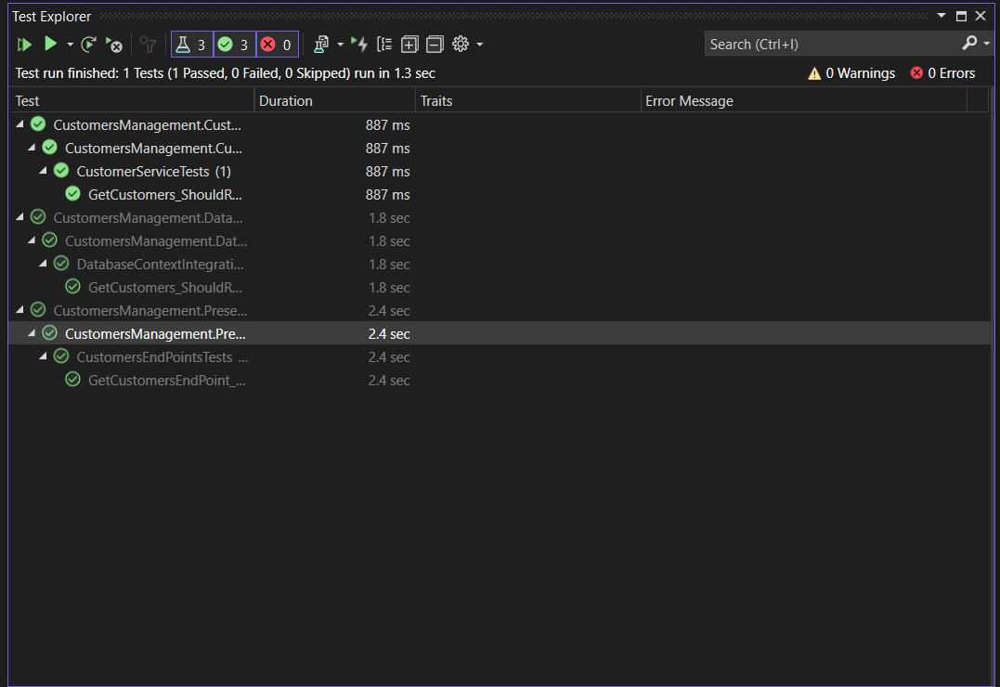

# CustomersManagement API

## &nbsp;&nbsp; Source Code

### &nbsp;&nbsp;&nbsp;&nbsp; CustomersManagement.Presentation

> Contains the web api project

### &nbsp;&nbsp;&nbsp;&nbsp; CustomersManagement.Application

> Contains the business logic and the customers entity

### &nbsp;&nbsp;&nbsp;&nbsp; CustomersManagement.Infrastructure

> Contains the database implementation using entity framework core

## &nbsp;&nbsp; Tests

### &nbsp;&nbsp;&nbsp;&nbsp; CustomersManagement.CustomersServiceUnitTestWithMoqing

> Contains the unit tests for the customer service without using a real database with moq techniques

### &nbsp;&nbsp;&nbsp;&nbsp; CustomersManagement.DatabaseIntegrationTests

> Contains the integration tests for the connection with the sql server database

### &nbsp;&nbsp;&nbsp;&nbsp; CustomersManagement.PresentationIntegrationTests

> Contains the integration tests for the /customers endpoint

## Test Results

